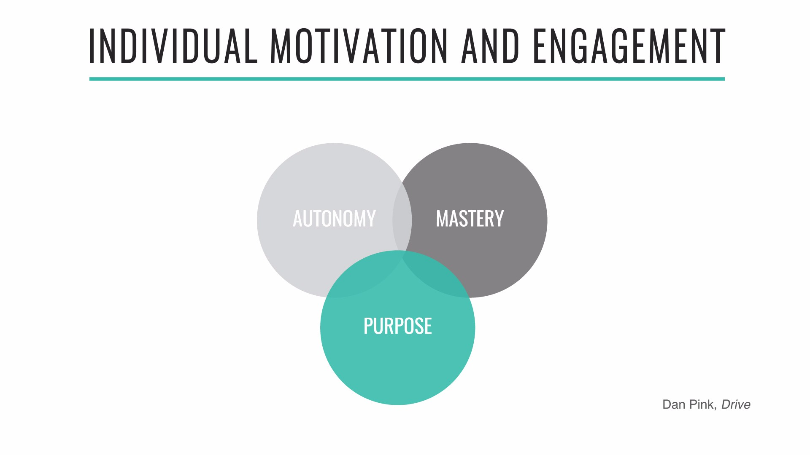

[<< back to main course website](index.html)

## Module 2: Purposeful Organizations

[Watch Module 2 on LinkedIn Learning](https://www.linkedin.com/learning/lean-technology-strategy-purposeful-organizations)

### Unit 1: What is a Purposeful Organization?

> The purpose of an organization is to enable ordinary human beings to do extraordinary things.
> &mdash;Peter Drucker

> Shareholder value is the dumbest idea in the world…[it is] a result, not a strategy…Your main constituencies are your employees, your customers, and your products.
> &mdash;Jack Welch

The idea of a common purpose known to all employees is essential to the success of an enterprise.

A company’s purpose is different from its vision statement (which describes what an organization aspires to become) and its mission (which describes the business the organization is in).
In the context of corporations, the idea of a common purpose other than profit maximization may seem quaint. Yet research has shown that focusing only on maximizing profits has the paradoxical effect of reducing the rate of return on investment.

Rather, organizations succeed in the long term through developing their capacity to innovate and adopting the strategy articulated by Jack Welch in the above epigraph: focusing on employees, customers, and products.

### Unit 2: Creating Alignment At Scale

The key to creating a lean enterprise is to enable those doing the work to solve their customers’ problems in a way that is aligned with the strategy of the wider organization. To achieve this, we rely on people being able to make local decisions that are sound at a strategic level—which, in turn, relies critically on the flow of information, including feedback loops.

Information flow has been studied extensively by sociologist Ron Westrum, primarily in the context of accidents and human errors in aviation and healthcare. Westrum realized that safety in these contexts could be predicted by organizational culture, and developed a “continuum of safety cultures” with three categories:

These cultures process information in different ways. Westrum observes that “the climate that provides good information flow is likely to support and encourage other kinds of cooperative and mission-enhancing behavior, such as problem solving, innovations, and interdepartmental bridging. When things go wrong, pathological climates encourage finding a scapegoat, bureaucratic organizations seek justice, and the generative organization tries to discover the basic problems with the system.”

To create a high-trust, generative culture is not only important for creating a safe working environment—it is the foundation of creating a high-performance organization.

#### The Principle of Mission

High-trust organizational culture is often contrasted to what is popularly known as “command and control”: the idea from scientific management that the people in charge make the plans and the people on the ground execute them—which is usually thought to be modeled on how the military functions. In reality, however, this type of command and control has not been fashionable in military circles since 1806 when the Prussian Army, a classic plan-driven organization, was decisively defeated by Napoleon’s decentralized, highly motivated forces. Napoleon used a style of war known as _maneuver warfare_ to defeat larger, better-trained armies.
People studied Napoleon's armies to understand how they outperformed their competitors. They noted that Napoleon’s officers had the authority to make decisions as the situation on the ground changed, without waiting for approval through the chain of command. This allowed them to adapt rapidly to changing circumstances.

What people realized is orders always include a passage which describes their _intent_, communicating the _purpose_ of the orders. This allows subordinates to make good decisions in the face of emerging opportunities or obstacles which prevent them from following the original orders exactly.

These ideas form the core of the doctrine of Mission Command and what enables maneuver warfare to work at scale—it is key to understanding how enterprises can compete with startups.

### Unit 3: Outcomes over Outputs

High performance teams focus on business outcomes rather than work outputs such as the number of stories completed (team velocity), lines of code written, or hours worked. Indeed, the goal is to *minimize* output while maximizing outcomes: the less effort and investment to achieve our desired business goals, the better.

The result of a quality planning process is a list of measurable target outcomes we wish to achieve over the next iteration or time horizon describing the *intent* of what we are trying to achieve (e.g. the Principle of Mission) and adopts a *goal-oriented* approach to product development.

Goal-oriented product development has been in use for decades, but most people are still used to defining work in terms of features and benefits rather than measurable business and customer outcomes. The features-and-benefits approach plays to our natural bias towards coming up with solutions, and listing out all the requirements we assume must be implemented to create that complete, and often over-engineered solution.
Examples good customer and business outcomes include increasing revenue per user, targeting a new market segment, solving a given problem experienced by a particular persona, increasing the performance of our system, or reducing transaction cost.

The framework we like to use for defining outcomes to achieve is this:

> WE BELIEVE THAT < _performing this initiative_ >

> WILL < _achieve this result_ >


> WE WILL KNOW THIS IS TRUE WHEN < _measurable outcomes not outputs_ >

This approach is refered to as [Hypothesis-Driven Development](http://barryoreilly.com/2013/10/21/how-to-implement-hypothesis-driven-development/).

#### Exercises

* Review the goals that you are currently working towards. Are they outputs or outcomes?
* Use the Transformation Target Conditions framework for to write two or three outcomes for the initiative your working on.
* What would be the customer, business, team and technology outcomes you want to achieve?

### Unit 4: How Purpose Empowers Mission Command

The process of shaping the vision begins by clearly articulating the problem that the team will try to solve. This essential step is often overlooked, or we assume everyone knows what the problem is. The quality of a problem statement increases our team’s ability to focus on what really matters—and, more importantly, ignore what does not. By developing our team’s shared understanding of our goals and what we aim to accomplish, we improve our ability to generate better solutions.

Dan Pink argues in _Drive_ there are three key elements to consider when building an engaged and highly motivated team. First, success requires a shared sense of _purpose_ in the entire team. The vision needs to be challenging enough for the group to have something to aspire to, but clear enough so that everyone can understand what they need to do. Second, people must be empowered by their leaders to work _autonomously_ to achieve the team objectives. Finally, people need the space and opportunity to _master_ their discipline, not just to learn how to achieve “good enough.”

#### Exercises

* Have you setup a Mission Command for your initiative?
* Have you written down the values and behaviors you wish to see demonstrated on the initiative?
* What are the outcomes the initiative is aiming for?
* What working agreements with you have in place?
* Have you clarified the roles and responsibility for people, when and how often you meet?
* Could you hold your iteration reviews and meetings at Mission Command to share context at speed and reduce writing reports for writing's sake?

[<< back to main course website](index.html)
