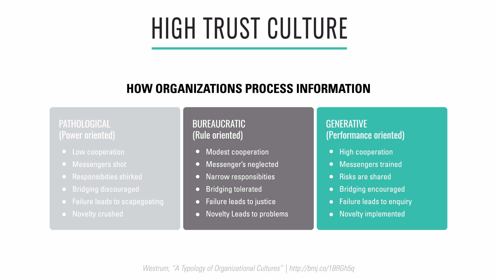
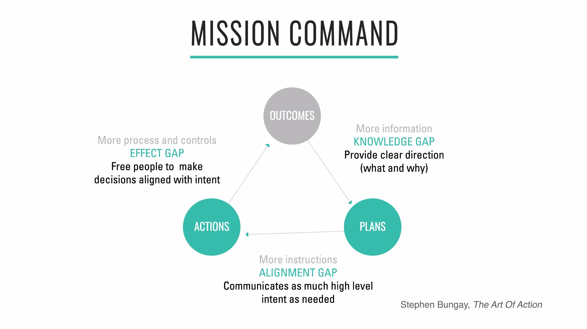

[<< back to main course website](index.html)

## Module 2: Purposeful Organizations

[Watch Module 2 on LinkedIn Learning](https://www.linkedin.com/learning/lean-technology-strategy-purposeful-organizations)

### Unit 1: What is a Purposeful Organization?

> The purpose of an organization is to enable ordinary human beings to do extraordinary things.
> - Peter Drucker

> Shareholder value is the dumbest idea in the world…[it is] a result, not a strategy…Your main constituencies are your employees, your customers, and your products.
> - Jack Welch

The idea of a common purpose known to all employees is essential to the success of an enterprise.

A company’s purpose is different from its vision statement (which describes what an organization aspires to become) and its mission (which describes the business the organization is in).
In the context of corporations, the idea of a common purpose other than profit maximization may seem quaint. Yet research has shown that focusing only on maximizing profits has the paradoxical effect of reducing the rate of return on investment.

Rather, organizations succeed in the long term through developing their capacity to innovate and adopting the strategy articulated by Jack Welch in the above epigraph: focusing on employees, customers, and products.

### Unit 2: Creating Alignment At Scale

The key to creating a lean enterprise is to enable those doing the work to solve their customers’ problems in a way that is aligned with the strategy of the wider organization. To achieve this, we rely on people being able to make local decisions that are sound at a strategic level—which, in turn, relies critically on the flow of information, including feedback loops.

Information flow has been studied extensively by sociologist Ron Westrum, primarily in the context of accidents and human errors in aviation and healthcare. Westrum realized that safety in these contexts could be predicted by organizational culture, and developed a “continuum of safety cultures” with three categories:

These cultures process information in different ways. Westrum observes that “the climate that provides good information flow is likely to support and encourage other kinds of cooperative and mission-enhancing behavior, such as problem solving, innovations, and interdepartmental bridging. When things go wrong, pathological climates encourage finding a scapegoat, bureaucratic organizations seek justice, and the generative organization tries to discover the basic problems with the system.”

To create a high-trust, generative culture is not only important for creating a safe working environment—it is the foundation of creating a high-performance organization.

#### The Principle of Mission

High-trust organizational culture is often contrasted to what is popularly known as “command and control”: the idea from scientific management that the people in charge make the plans and the people on the ground execute them—which is usually thought to be modeled on how the military functions. In reality, however, this type of command and control has not been fashionable in military circles since 1806 when the Prussian Army, a classic plan-driven organization, was decisively defeated by Napoleon’s decentralized, highly motivated forces. Napoleon used a style of war known as _maneuver warfare_ to defeat larger, better-trained armies.
People studied Napoleon's armies to understand how they outperformed their competitors. They noted that Napoleon’s officers had the authority to make decisions as the situation on the ground changed, without waiting for approval through the chain of command. This allowed them to adapt rapidly to changing circumstances.

What people realized is orders always include a passage which describes their _intent_, communicating the _purpose_ of the orders. This allows subordinates to make good decisions in the face of emerging opportunities or obstacles which prevent them from following the original orders exactly.

These ideas form the core of the doctrine of Mission Command and what enables maneuver warfare to work at scale—it is key to understanding how enterprises can compete with startups.

[<< back to main course website](index.html)
