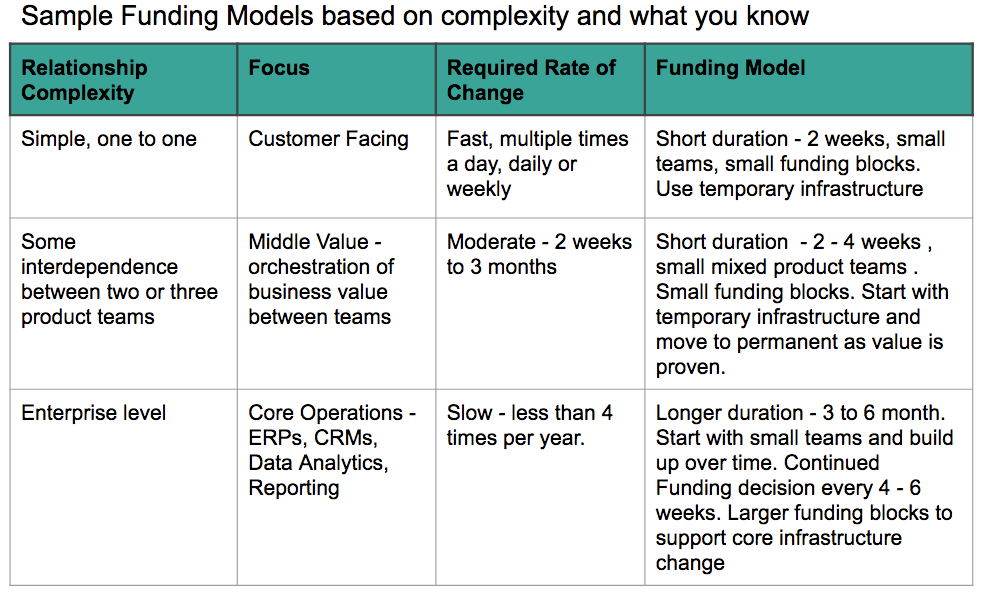
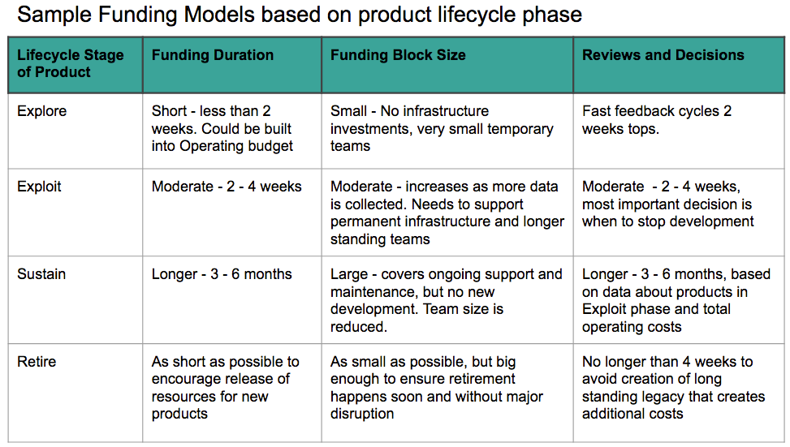
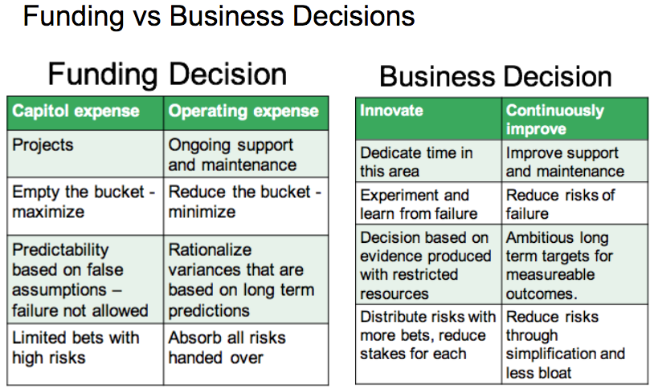
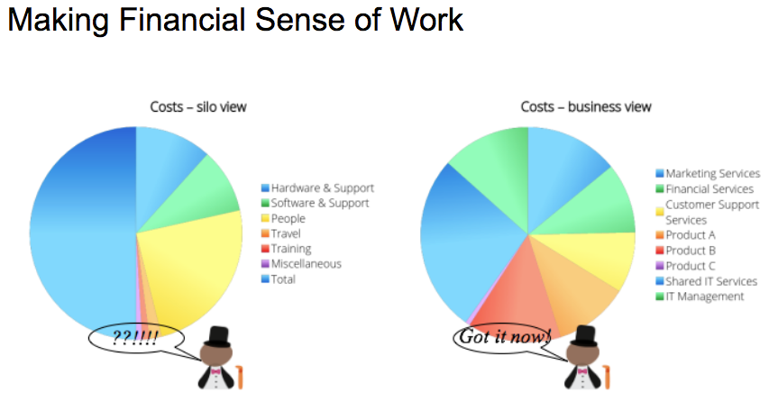

[<< back to main course website](index.html)

## Module 3: Financial Management to Support Business Agility
    
[Watch Module 3 on LinkedIn Learning](https://www.linkedin.com/learning/lean-technology-strategy-financial-management-to-support-business-agility)

### Unit 1: Pitfalls of Classic Financial Management

Budgeting is important, we need to do it. However, some of the associated practices are driving waste and increased costs.

**Conflation of the budget with:**

* **Target Setting** - Usually executive demanding targets that are determined using sanitized, and therefore incomplete and inaccurate, information or making decisions without understanding the impact to customers. For example: I worked in health care in Alberta, Canada. In the mid 1980s when the government mandated a reduction in healthcare spending across the board. This included salaries (mine was cut by 10%), supplies and equipment and services. The result?
  * Good people left healthcare to pursue other careers that promised more opportunity and less depressing and exhausting work.
  * Services to the public decreased, not only the number of services, but the availability - it took longer to access the services.
  * Service quality decreased - the providers were overworked, using cheaper supplies that didn't do as good a job, and equipment that became outdated and more costly to repair.
No one was happy.
* **Forecasting of Business Activity** - Asking people to predict events and costs far into the future, then holding people responsible for failure of things to unfold as predicted. It is reasonable to use placeholders for expenses for the next 12 months, but these need to be reviewed and updated regularly, with the goal to change the numbers and allocations that no longer make sense as you learn more and events unfold.
* **Resource Allocation** - Aligning people around organization silos for the entire year or longer, reducing flexibility for sharing knowledge and skills across teams and organization units.

The Budget process should be about const control. The length of your planning and review cycles will depend on many different factors. Regardless of what you choose, remember not to conflate the budget with these other activities.

**Performance Management** - Using how well one adheres to the approved budget as an indicator of performance is the most destructive misuse of the budgeting process. Although it is important to keep an eye on costs, the best performance comes with an ability to recognize if that expense is actually delivering value and adjusting expenditure as needed to continue to deliver value.

### Unit 2: Alternative Funding Models

What do you use instead of an annual budget model?

Think about reducing risks by making less expensive, more frequent funding decisions based on a series of experiments, or product that is actually in use. This can provide better data on which to base decisions and more importantly, stop further development on products or services that are not delivering expected value.

Use a sliding scale for funding that adjusts oversight and approvals on relative risk and ability to deliver working software that delivers measurable value. Th less you know about the product, the greater the risk in funding. As complexity increases, so do the risks, but it takes longer to work through problems ad deliver working solutions.

### Unit 3: Making Business Decisions, Not Budget Decisions

On budget does not equal high performance, success or value.

On organizing projects and work based on funding source: Capitol vs Operating Expenses. This is an accounting problem, figure it out with accountants, but don't let it force you into a way of working that creates functional silos, complex communication, and excessive reporting on where people are spending their time.

How to get to business decisions:

* Collaborate to set measurable outcome at the organizational level
* Teams allowed to set targets and experiment to reach them
* Work in smaller batches (blocks of work)
* Collect data that supplies faster feedback
* Create a culture of experimentation and learning

Reducing waste does not mean cutting costs. Although one can lead to another, it isn't always true. Cutting costs in some areas may actually increase costs and waste in other ares. Reducing waste involves taking an end to end view of the work being performed and creating a continuous flow of the work with reduced wait times, reduced rework and failure demand, and improved customer satisfaction.

### Unit 4: Rolling It Up - Keeping Everyone Going in the Same Direction

Managing and controlling costs is still critical to all organizations' success. We need to keep doing this.

Tract trends of your financial metrics over time, relating them to business activity, product and services.

Create faster feedback loops - adjust accordingly.

Focus on what you know - in shorter period of time - use placeholders for what you know about and continue to seek information on what you don't know. When opportunities for improving revenues and services at a reasonable cost are presented, divert resources from less valuable work. in other words, stop doing work that doesn't create value for your organization.

Beware you don’t land up just recreating the annual budget process, only 4 times a year instead of once. Without dynamic resource allocation and team autonomy to determine the best way to achieve goals, changing to quarterly or monthly rolling forecasts just create more waste.

Financial Reporting

Compare products and services using common measures throughout the organization

* Total cost per unit of value
* Compare the relationship in changes between products, services and functional units

Use the balanced scorecard: it's not just about controlling costs. Measures and metrics should provide information to answer the following questions:

* Are we doing the right thing? Do we have strategic alignment of our work, in line with vision and business principles at an acceptable level of risk?
* Are we doing it the right way? Do we have a learning culture which creates new ideas and allows experimentation to try new things that allow us to improve?.
* Are we doing it well? Do we have a flexible process designed to allow teams to get work done to the standards we expect?
* Are we getting the value from the work? Do we know what the value is, are we measuring it and are we doing something about it when we aren’t getting value?

Award performance over the long term, not financial management skills.

Performance does not include:

* Spending as much or less than you said you will.
* Executing a detailed plan: it could be the wrong thing, done the wrong way

Remember to compete with competitors, not amongst yourselves.

Award at an organizational level, not the individual level. Performance rewards that are delivered to all levels of the organization are more motivating that those that focus on top executive and senior management.

### References and Further Reading

* [Beyond Budgeting Institute](https://bbrt.org/)
* [Management Innovation Exchange](http://www.managementexchange.com/)
* Bognes, B. (2009) _Implementing Beyond Budgeting_. John Wiley & Sons
* Hope, J. and and Frazer, R. (2003), _Beyond Budgeting: How Mangers Can Break Free from the Annul Performance Trap._ Harvard business School Press

[<< back to main course website](index.html)
