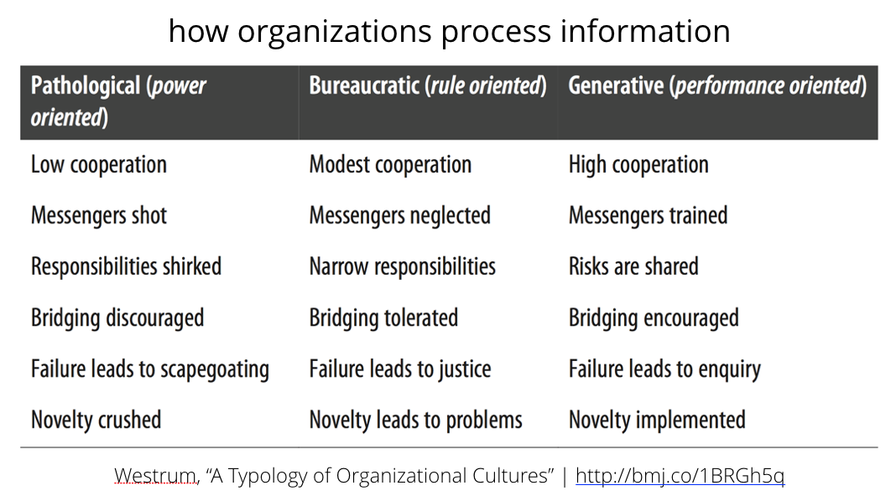

[<< back to main course website](index.html)

## Module 4: Building High Performing Teams

[Watch Module 4 on LinkedIn Learning](https://www.linkedin.com/learning/lean-technology-strategy-building-high-performing-teams)

### Unit 1: Taylorist Management vs Lean Management

This unit discusses Frederick Winslow Taylor's Scientific Management, and compares it with the approach to management put forward by the Lean movement.

Taylor published his best-known work, [The Principles of Scientific Management](https://www.gutenberg.org/ebooks/6435), in 1911. It became one of the 20th Century's most influential texts on management. Among the ideas he promoted were:

* The use of time and motion studies to analyze and standardize processes, and to determine the most efficient way to perform them.
* Managers should apply scientific principles to plan work, with workers having the responsibility of executing tasks as efficiently as possible.
* Workers should be rewarded for their output.

While these ideas can be effective for work that is _algorithmic_, where there exists a single "best practice" which can be followed exactly and will always produce the same outcome. However Taylorist ideas are not effective in knowledge work, where there is no one "best practice" that will be effective in all situations, and where teams must problem solve in order to discover how to proceed.

The Lean movement has championed a management paradigm that finds its roots in Japanese manufacturing, particularly early leaders in the Toyota company such as Shigeo Shingo, Taiichi Ohno, and Sakichi and Kiichiro Toyoda, combined with the work of luminaries such as W. Edwards Deming. This paradigm emphasizes the importance of giving workers the resources, tools and authority to improve their work, combined with a set of heuristic tools that enable just-in-time delivery and building in quality at the source.

In the Lean paradigm, managers play an important role in enabling workers to implement these tools in a scientific way in pursuit of clearly defined organizational goals. This, in particular, requires investing in the development of people rather than treating them as replaceable, interchangeable resources.

#### Further Reading

In this unit I discuss Deming's [Fourteen Points for Management](https://blog.deming.org/2013/04/demings-14-points-for-management/), a short read that bears long and repeated reflection. In addition, I refer to the following books:

* _Out of the Crisis_ by W. Edwards Deming, in which his Fourteen Points were originally presented.
* _The Human Side of Enterprise_ by Douglas McGregor

#### Exercise questions

* Do you do regular one-on-ones with your direct reports?
* How often do you do them?
* Do you know what motivates your people, both professionally and personally?
* What can you do to align the motivations and passions of your people with the work you have to do?
* How can you help develop their careers? Do you know what their goals are for the next year, or three years?

### Unit 2: What Makes a High Performing Team?

This unit explores [research performed by DevOps Research and Assessment, Google, and Puppet](https://www.devops-research.com/research.html) into how to build high performing organizations. The research shows:

* High levels of IT performance (defined in terms of both throughput and stability) predicts organizational performance: organizations with high performing IT capability were twice as likely to outperform their low performing peers in terms of productivity, market share and profitability.
* Job satisfaction and employee net promoter score predict organizational performance.
* Organizational culture predicts IT performance, job satisfaction, and employee net promoter score.

In the research, we model culture using [a typology created by Ron Westrum](http://bmj.co/1BRGh5q).

Two particularly notable features of this typology are how we deal with failure and how we deal with novelty. High performing organizations treat failure as an opportunity to learn how to improve. Organizations that behave this way are more likely to innovate, since in an organization where failure is punished, people are unlikely to take risks. This is confirmed in [a study performed by Google](https://rework.withgoogle.com/blog/five-keys-to-a-successful-google-team/), where psychological safety was found to be the biggest factor in high performance.

#### Exercise questions

* How do you deal with bad news? Do you look for ways to improve, or do you shut down the discussion?
* If you're working on a team where something has gone wrong are you comfortable telling people?
* How do you respond to scope creep or changes in the work you're doing? Do you treat it as bad news, or a potential opportunity?

### Unit 3: How to Change Culture: The NUMMI Case Study

This unit tells the story about NUMMI, and how a joint partnership between GM and Toyota turned GM's worst performing team into its best performing team, and how they changed the culture of the organization to achieve this.

A good reference for this story is [Episode 561 of the This American Life podcast](https://www.thisamericanlife.org/radio-archives/episode/561/nummi-2015). A [transcript](https://www.thisamericanlife.org/radio-archives/episode/561/transcript) is also available.

The idea of building quality in to work, which is also one of [Deming's Fourteen Points](https://blog.deming.org/2013/04/demings-14-points-for-management/), has a long history in Toyota, starting with their [Automatic Loom Type G](http://www.toyota-global.com/company/vision_philosophy/toyota_production_system/jidoka.html), which detects problems automatically and tells the operator, rather like a continuous integration system which runs automated tests whenever a change is made to a software system and tells the developers so they can fix it straight away.

In his award-winning article on [how NUMMI changed culture](http://sloanreview.mit.edu/article/how-to-change-a-culture-lessons-from-nummi/), John Shook says, "what changed the culture was giving employees the means by which they could successfully do their jobs. It was communicating clearly to employees what their jobs were and providing the training and tools to enable them to perform those jobs successfully." Similarly when building software, the [technical practices of continuous delivery](https://continuousdelivery.com/) can enable the same outcome, and has been shown to have a positive impact on culture, as well as reducing burnout, improving quality, and increasing IT performance.

### Unit 4: Improving Performance

Often organizations think they can improve by hiring "the best" people. But in organizations, building effective teams are what's important, and systemic effects dwarf individual differences. As Deming says, and as the NUMMI case study shows, "a bad system will beat a good person every time." In Malcolm Gladwell's article [The Talent Myth](https://www.newyorker.com/magazine/2002/07/22/the-talent-myth) he tells the story of how Enron operated by hiring the best people it could find and then letting them get on with it. Gladwell writes, "The talent myth assumes that people make organizations smart. More often than not, it’s the other way around...Our lives are so obviously enriched by individual brilliance. Groups don’t write great novels, and a committee didn’t come up with the theory of relativity. But companies work by different rules. They don’t just create; they execute and compete and coordinate the efforts of many different people, and the organizations that are most successful at that task are the ones where the system is the star."

Gladwell also discusses the work of Carol Dweck. In her book _Mindset: The New Psychology of Success_, she discusses her research program which identifies two mindsets: "In a fixed mindset, students believe their basic abilities, their intelligence, their talents are just fixed traits. They have a certain amount and that’s that, and then their goal becomes to look smart all the time and never look dumb. In a growth mindset, students understand that their talents and abilities can be developed through effort, good teach- ing, and persistence. They don’t necessarily think everyone’s the same or anyone can be Einstein, but they believe everyone can get smarter if they work at it." In technology in particular, where the skills required change regularly, an important goal for managers is to create a growth mindset in teams.

An important way that high performance organizations move fast is by creating autonomous teams. However this requires careful organizational design, you can't just tell teams "be autonomous!" Rather, we should:

* Give teams the tools and authority to choose tools and push changes to production.
* Ensure teams have the skills and authority to design, run, and evolve experiments.
* Remove dependencies between teams: architectural, communication, approval.
* Create alignment and transparency through effective leadership.

Managers have an important role in creating a learning environment which encourages a growth mindset. Examples of how they can achieve this include:

* Implementing the Improvement Kata
* Helping reports develop and implement career plan
* Running regular 1:1s
* Facilitating regular team retrospectives
* Helping teams to fail fast and build resilience

One example of helping teams to learn from failure is through [disaster recovery testing exercises](http://queue.acm.org/detail.cfm?id=2371297), in which teams work together as a real disaster recovery scenario is executed.

#### Exercises

* When was the last time you executed your disaster recovery process or failed over to your backup system?
* Do you have processes to learn from failures such as blameless post mortems?

#### Further Reading

* _The Manager's Path: A Guide for Tech Leaders Navigating Growth & Change_ by Camille Fournier
* _Effective DevOps: Building a Culture of Collaboration, Affinity, and Tooling at Scale_ by Jennifer Davis and Ryn Daniels
* _Behind Closed Doors: Secrets of Great Management_ by Johanna Rothman and Esther Derby
* _Lead With Respect: A Novel of Lean Practice_ by Michael Ballé and Freddy Ballé
* _Mindset: The New Psychology of Success_ by Carol Dweck
* _Drive: The Surprising Truth About What Motivates Us_ by Dan Pink

### Unit 5: Principles for High Performing Teams

In this unit I summarize five principles to create high performing teams:

* Effective leadership creates empowered, autonomous teams
* Leadership works to create alignment and transparency
* Managers help teams learn and improve in pursuit of organizational goals
* Create psychological safety, give teams tools and resources they need
* Practice failing, learn how to improve

[<< back to main course website](index.html)
