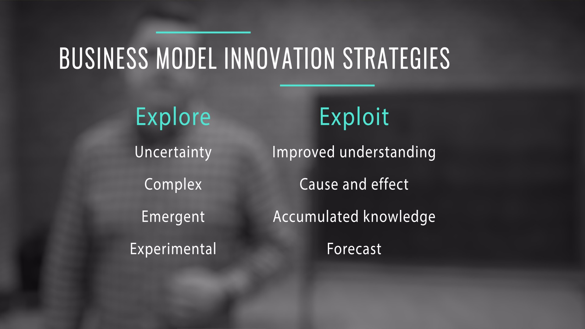
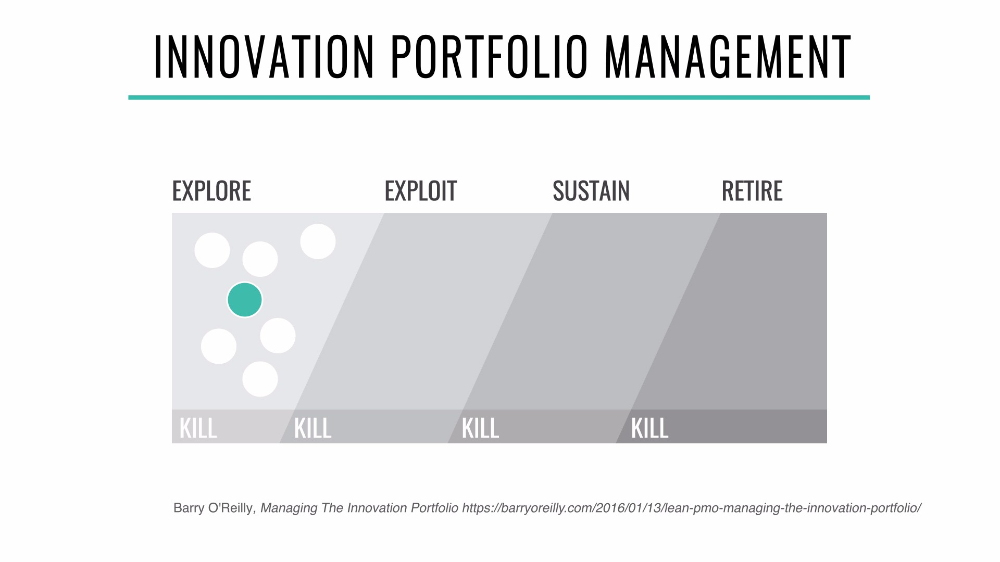
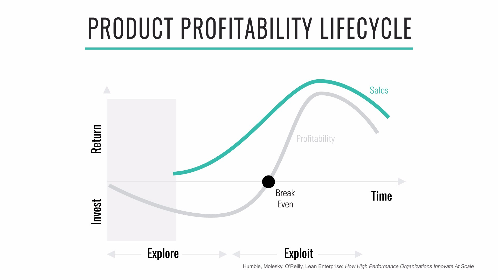
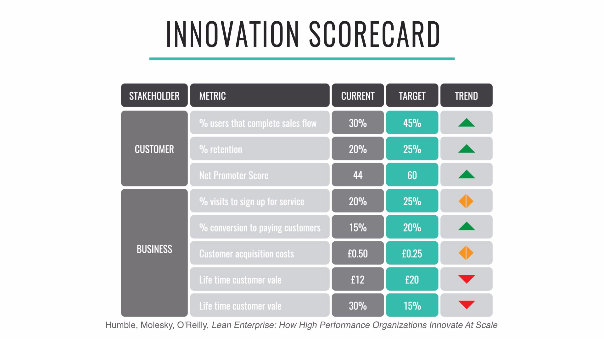

[<< back to main course website](index.html)

## Module 5: Managing the Innovation Portfolio

[Watch Module 5 on LinkedIn Learning](https://www.linkedin.com/learning/lean-technology-strategy-managing-the-innovation-portfolio)

### Unit 1: The Lifecycle of Innovation

In this unit we will examine the lifecycle of businesses and how companies can balance the _exploration_ of new business models with the _exploitation_ of proven ones.

Over time, all successful ideas, whether technologies, product categories, business models, or even methodologies, progress from being scarce and unevenly distributed to eventually becoming a commodity. They then form building blocks for new, higher-level, more valuable innovations. Of course the time it takes for innovations to progress through the various stages of the cycle can vary substantially.

![The continuous lifecycle of innovation](assets/images/module5_unit1_innovation_lifecycle.jpg]

The first point to observe is that products at different stages of maturity vary significantly in terms of how they are managed, developed, marketed, and funded. For example, in a mature market we have a good understanding of our customers and the value they get from the product; acquiring new customer or selling new products to existing ones is well understood, and new products in the category typically contain only incremental innovations. For new categories, the opposite is true.

While there is a lot of detail involved in understanding these different stages of the lifecycle, such as whether our customers are other businesses or consumers, we can get to the important discussion by drastically simplifying the problem and looking at two key activities that all enterprises will engage in: _exploring_ new product categories and business models, and _exploiting_ the proven ones. Steve Blank refers to these activities as “search” and “execute” in the context of customer development.

Startups begin by exploring new opportunities through business model innovation: they search for a new business model that is aligned with the founders’ purpose and vision, delivers value for customers, and can drive the profitability and growth of the organization. Once it is found, the business model is exploited by growing and scaling it, finding ways to drive down costs, improve efficiency, and increase market share and customer base. However, every business model is ultimately transient: eventually, every business model and product category will be _mature_, _decline_ or be disrupted by new ones—it is only a matter of time.

### Unit 2: Strategies for Business Model Innovation - Explore versus Exploit

When operating in the new economy, simply trying to improve existing initiatives and optimize efficiency is not enough to provide long term sustainability. Organizations need to be continually in search of new opportunities to stay relevant. [Explore is fundamentally a different operating environment compared to Exploit](https://barryoreilly.com/2015/12/14/lean-pmo-explore-vs-exploit/). Organizations need to to leverage new technologies, customer insights and emerging trends to unearth new business models, products and services their customers and users desire.

Typically, existing organizational structures, strategies and processes for executing initiatives simply do not work in an exploratory context.For example, measuring return on investment during explore phases makes little sense and provides little insight as you are typically investing to reduce the uncertainty of building the wrong thing. Few new business models or products generate large revenue in the beginning hence will also fail to measure up to more mature initiatives that are in an exploit phase or later.

A key goal of successful portfolio management in the enterprise is understanding how to balance exploring new business with exploiting proven existing business models – and how to transition businesses successfully between these domains. Leaders must understand the difference between these domains and be able to design, implement and operationalize the required mindset, strategies and people that govern them. If it’s fallen to the CEO to manage the organization has not built the capability and will struggle to continually evolve.

#### Mapping the Innovation Portfolio

Portfolio mapping requires taking an end-to-end view of the lifecycle of initiatives in your organization. Lean Enterprises consider four main domains:

* *Explore* early stage initiatives that are bets for the future with high degrees of uncertainty
* *Exploit* initiatives that have achieved product-market fit and the organization wants to grow and scale
* *Sustain* initiatives that have become repeatable and scalable business models, products or services that drive the majority of revenue for the organization
* *Retire* initiatives that are long lived, no longer beneficial (even limiting) to the organization future success or strategy and should be sunset from the portfolio

Initiatives that do not achieve desired outcomes in any domain should be killed, and their investment transferred to other initiatives.

[High performance organizations focus on building capability to continuously move initiatives through the model from Explore to Retire](https://barryoreilly.com/2016/01/13/lean-pmo-managing-the-innovation-portfolio/). They understand that using the same strategy, practices and processes across the entire portfolio will result in negative outcomes and results.

## Unit 3: Principles and Capabilities for Innovation Portfolio Management

Exploring new opportunities, exploiting existing ones, sustain long lived and retiring out-dated innovations are fundamentally different strategies requiring difference structure, competencies, processes, and mindset. It is hard to overemphasize the key point: management practices that are effective in the exploit domain will lead to failure if applied to exploring new opportunities – and vice versa.

In order to managed your portfolio effectively consider the following principles and capabilities for each domain:

#### Principles and capabilities for Explore

* Cross-functional multidisciplinary teams
* Make lots of small bets
* Boundaries of time, scope, financial investment and risk
* Design experiments are safe to fail (the only true failure is the failure to learn)
* Create a sense of urgency
* Demonstrable evidence of value to proceed

#### Principles and capabilities for Exploit

* Create end-to-end customer facing teams, not project teams
* Continuous evaluation funding model
* Target condition is to achieve break-even point
* Data-driven, fact-based decisions based on accumulated knowledge
* Maintain a sense of urgency
* Set a vision, trust the team to get there, clear blockers
* Make knowledge sharing and organizational learning easy

#### Principles and capabilities for Sustain

* Beware of the feature fallacy
* Focus on what is valuable – where can we win?
* Don’t get lazy. Success hides suboptimal issues
* Keep discipline with fact and evidence-based decisions
* What is being used, improved or removed?
* How could we disrupt or get disrupted?

#### Principles and capabilities for Retire

* Has it served its purpose? Can we sunset it?
* It is providing value? Kill it if it is not.
* Are there better opportunities to invest in?
* Continually look to reduce product and system complexity
* Simplifying helps to support further innovation
* Free up funds and capability

If your leadership team is unclear on how your portfolio is performing and what initiatives you are exploring, exploiting, sustaining and retiring, get a cross-functional group together and map out your portfolio to visualize your work in progress.

Ask if it is achieving the desired outcomes and aligned to your business strategy and objectives. Share the results of the exercises with your teams and business leaders. Then starting getting deliberate about investment of time, effort and people in becoming the business you want to be.

### Unit 4: Innovation Accounting

> It’s not enough just to do your best. You must know what to do, then do your best.
> &mdash;W. Edwards Deming

We live in a world of data overload, where any argument can find supporting data if we are not careful to validate our assumptions. Finding information to support a theory is never a problem, but testing the theory and then taking the correct _action_ is still hard.

Eric Ries introduced the term _innovation accounting_ to refer to the rigorous process of defining, experimenting, measuring, and communicating the true progress of innovation for new products, business models, or initiatives. To understand whether our product is valuable and hold ourselves to account, we focus on obtaining admissible evidence and plotting a reasonable trajectory while deal with conditions of extreme uncertainty.

Traditional financial accounting measures such as operating performance, cash flow, or profitability indicator ratios like return on investment (ROI)—which are not designed for innovation—often have the effect of stifling or killing new products or initiatives. They are optimized, and more effective, for exploiting well-understood domains or established business models and products. By definition, new innovations have a limited operating history, minimal to no revenue, and require investment to start up, as shown in the diagram below. In this context, return on investment, financial ratio analysis, cash flow analysis, and similar practices provide little insight into the value of a new innovation nor enable its investment evaluation against the performance of well-established products through financial data comparison alone.

### Unit 5: Creating Innovation Accounting Dashboards and Metrics

Which metrics we care about at any given time will depend on the nature of our business model and which assumptions we are trying to validate.

Customer success metrics provide insight into whether customers believe our product to be valuable. Business metrics, on the other hand, focus on the success of our own business model. For most organizations, collecting data is never an issue for new initiatives; the difficulties lie in getting actionable ones, achieving the right level of precision, and not getting lost in all the noise.

To help us improve, our dashboard should only show metrics that will trigger a change in behavior, are customer focused, and present targets for improvement. If we are not inspired to take action based on the information on our dashboard, we are measuring the wrong thing, or have not drilled down enough to the appropriate level of actionable data.

It's important to build tension into metric too - so we don't over optimize one measure and the expense of another. For example, it's easy to make conversion go up on a retail site by dropping the price. However the long term effect of price reduction also impacts our customer lifetime value. There is a natural tension between these metrics. For true innovation and progress we should aim to positivity affect conversion and customer lifetime value. Not one at the expense of another.

In terms of governance, the most important thing to do is have a regular weekly or fortnightly meeting which includes the product and engineering leads within the team, along with some key stakeholders from outside the team. During the meeting we will assess the state of the chosen metrics, and perhaps update on which metrics we choose to focus on (including the One Metric That Matters). The goal of the meeting is to decide whether the team should persevere, pivot or stop what we are doing based on the result of our work, and the data we have gathered.

#### Exercises

* What customer and business metrics would be on your innovation scorecard?
* Are they vanity or actionable metrics?
* Do you have a One Metric That Matters when working on innovation initiatives?
* Do you have tension metrics on your scorecard?

[<< back to main course website](index.html)
