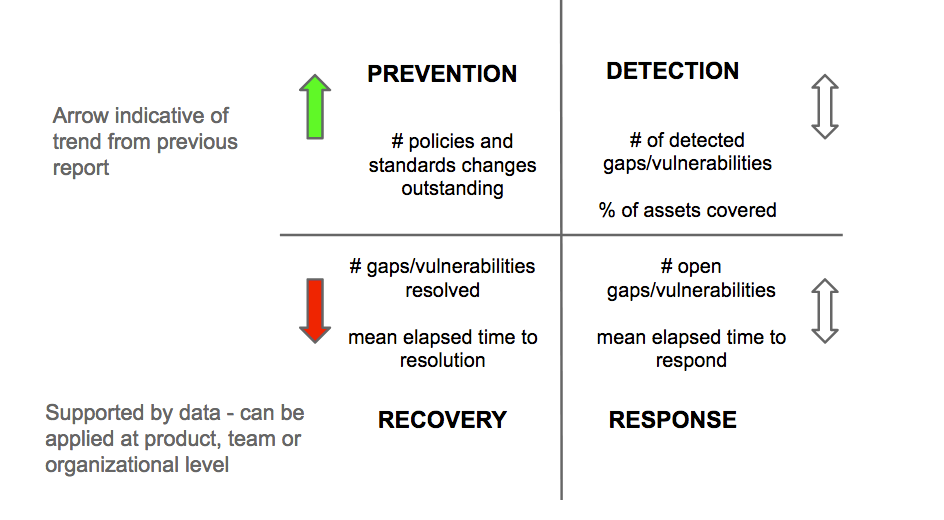
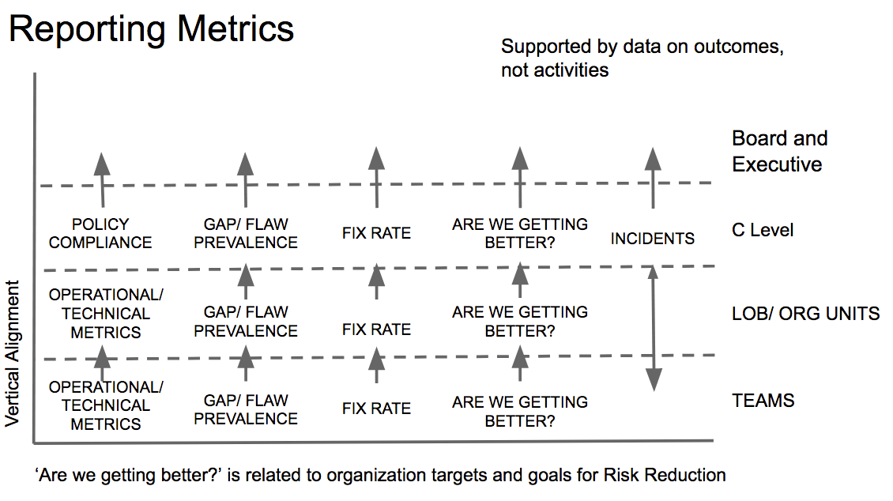

[<< back to main course website](index.html)

## Module 6: Moving Fast With Defined Constraints

* [Watch Module 6 on LinkedIn Learning](https://www.linkedin.com/learning/lean-technology-strategy-moving-fast-with-defined-constraints)

### Unit 1: Understanding the Boundaries

Regulations, policy and rules are required in many businesses. You must follow them, but they can cripple an organization's ability to get things done if a risk based approach is not taken to achieve compliance. The fear taking any risk due to regulatory compliance actually adds risk to your business and in many cases, defeats the intention of the regulation.

Although we can reduce risks by applying controls and performing audits, we can never eliminate risk. The goal is to reduce risk to an acceptable level for the business without stifling our organization's ability to change systems and services at the pace required by the business.

The biggest risk for today's business in the use of technology is you build the wrong thing or you build it the wrong way. Ironically, traditional regulations, controls and processes that were devised decades ago to prevent bad things from happening are actually causing other bad things to happen today in the form of:

* Increased overhead for control implementation and validation
* Increased time to market to new services and products
* Decreased transparency and bad decisions when inappropriate controls are forced on people doing the work. The tendency is for people to sidestep the controls in order to get things done.

As the capabilities and use of technology used to deliver working software to consumers evolves, so must controls to meet regulatory compliance.

### Unit 2: Understanding the Language of Risk and Compliance

To have meaningful conversations and reach good decisions on what should be done and how in order to meet regulatory compliance, both the delivery and the risk and compliance communities need to understand the language each other is using.

*Regulations* are laws. They must be followed. Generally speaking, most regulations have a specific intent to reduce risks to society. Some may have specific standards that must be met. _How_ organizations meet those standards is usually left unsaid in the regulation itself and is left to organizations to determine for themselves.

*Frameworks* in the IT world are generally ideas that are put together by a group of people who have experience in the field. These groups are generally self regulated. Some of these groups will offer certifications and stamps of approval on practices, but usually that is not related to government regulations. Think of frameworks as providing advice on how you could approach your operations.

*Standards* are criteria that must be met during the course of operating a business. They can be externally imposed by regulatory bodies, but they can also be internally agreed on and followed to help improve value delivery.

Laws and regulations and frameworks _influence_ management decisions on how to operate and what controls need to be in place to stay on the good side of the law and deliver value to cusotmers.

*Controls* are checks and balances that are placed on an organization's operations. They can be imposed to meet regulatory compliance, but the best controls are those that are self-imposed to ensure value delivery from the work that is performed.

*Controls* often take the form of:

* *Policies*. These are high level statements that define expected behaviors of the people within the organization in order to meet the organizations purpose and goals.
* *Processes*. These are defined activities that transform inputs into outputs. In the world of IT Risk and Compliance, processes include some of the well known management processes such as Change management, Incident Management and Software Delivery Lifecycle Management. Good processes define the activities as what needs to be done during the process. Checks and balances, which are controls are often built into a process. In the Software Delivery Process, the usual activities are Analyze, Design, Build, Test, Release, etc. with checks and balances such as reviews and approvals.
* *Procedures*. These are defined ways of actually completing the activities in in a Process. This is the nitty gritty of how things get done and can be tool specific

*Governance* is that act of steering and organization towards meeting its purpose and goals. The structure put in place to achieve visibility and transparence. Some think of having defined org structures, policies and processes as good governance. this is not necessarily so. Good governance is about having hte visibility and transparency into who is doing what, why they are doing it and making sure is aligned to achieving the organizational purpose and goals.

### Unit 3: Share Responsibilities to Achieve Better Outcomes

Risk, Compliance and Security are everyone's responsibility. Unless everyone in the organization takes on this responsibility in their day to day work, it will never scale and will always drag down the organization, limiting people's ability to contribute to value delivery. How does an organization achieve this?

Form _guiding principles_ for doing the work. Here are some examples:

* Decisions are made when they are needed at the right level
* Go and see for yourself
* Do it with the right people - those responsible for getting the work done.
* Only do it if it adds value
* Simplify the process before automating
* Don’t slow down delivery unnecessarily, trust and verify
* Focus on risk and outcomes, not compliance
* Make the work visible

Use tools to help identify where policies, processes, procedures and related controls are either not providing enough oversight or demand too much, resulting in work slow down and waste:
* Customer Journey mapping helps put decision makers in the customer shoes. Think of other organizational units as your customer if that helps.
* Follow the Work - Map the end to end lifecycle of work - from idea through to a satisfied customer.
* Value stream mapping of the end to end flow of performing work. this exercise is good for identifying waste in the form of lengthening feedback cycles and reducing quality, wait times adn failure demand.

These tools are best used when people from different teams and organization units do it together.

Pay attention to important areas:
* Mind the access to all environments
* Maintain evidence
* Use a risk based approach to change (smaller changes are less risky)
* Avoid risk management theatre

#### Questions

* Who discovers security vulnerabilities and compliance breaches? How are they reported?

#### Exercise

* List the guiding principles your organization has for managing risk and compliance, written or unwritten.
* Choose one of the following to discover the impact risk management and compliance has on the work your teams’ work:
  * Follow the work
  * Map the customer journey
  * Value stream
* Identify one area that if changed for the better, would significantly improve your team's ability to get the work done. Discuss with your team to see if there is a better way to achieve the desired outcome.

### Unit 4: Creating Faster Feedback on Risk and Compliance, Governance, Measurement and Reporting

Too often the measurement, reporting and actions related to risk and compliance are considered to be the sole responsibility of the Governance, Risk and Compliance (GRC) teams (I include information security, or _infosec_, in this group). However, to establish a reasonable level of operational risk, everyone throughout the organization must be involved in the measurement and decisions related to how risk is managed and controlled. Everyone is responsible for this, not just you GRC teams.

Most GRC scorecards will provide a long list of controls expected to be in place for compliance and then indicate how many gaps exist today from the auditor's finding. that is really important from a compliance perspective, but being in compliance does not necessarily mean we are actually reducing risks. (Witness the number of PCI DSS compliant organizations who experience payment card information breaches).

Too often, it is only the GRC who is tracking and reporting on vulnerabilities, which implies that teams doing the work do not have any impact on the numbers. This likely comes out of the idea that GRC teams are independent, non biased judges of team activities, but we all know each of us has unconscious biases that have developed through our past experiences, personal values, how our peers treat us and how we have been taught to think. Therefore, when we say GRC and audit teams are non biased, it is likely that is not the case.

An alternative way to work is to require all teams to assume responsibility for tracking and reporting on risks related to the way they work. GRC teams can help with the discovery categorization of the risks. But when teams assume ownership and responsibility for the vulnerability, there is a stronger incentive to deal with it effectively. The GRC role is to provide advise on what is acceptable risk and clarify the boundaries that exist as a result of compliance, but it should never be to tell teams how they must work.

A Balanced Scorecard for GRC may look something like this:

The numbers are derived from bottom up reporting where all teems would be required to track, monitor and report on the gaps and vulnerabilities. Teams should be encouraged to create their own scorecard at the team level and make it visible as there is a constant reminder to think about risk.

Metrics are important and all teams need to share a common metric related to risk. Here is how metrics can be used for reporting risks and known vulnerabilities from the team level through to the Board and Executives.

Operational metrics for teams and org units will change over time, based on the targets fro improvement that the teams have set for themselves. They should be lead metrics related to "Are we getting better? For example if a team has set a target to apply all critical patches within 72 hours of release, they may want to measure the time/ability to test the patch or receive approvals to apply the patch. These in turn will lead to identifying other activities that will have to be performed. (Create a fast track approval, push patches in a low risk manner to part of the system before releasing it everywhere.)

[<< back to main course website](index.html)
