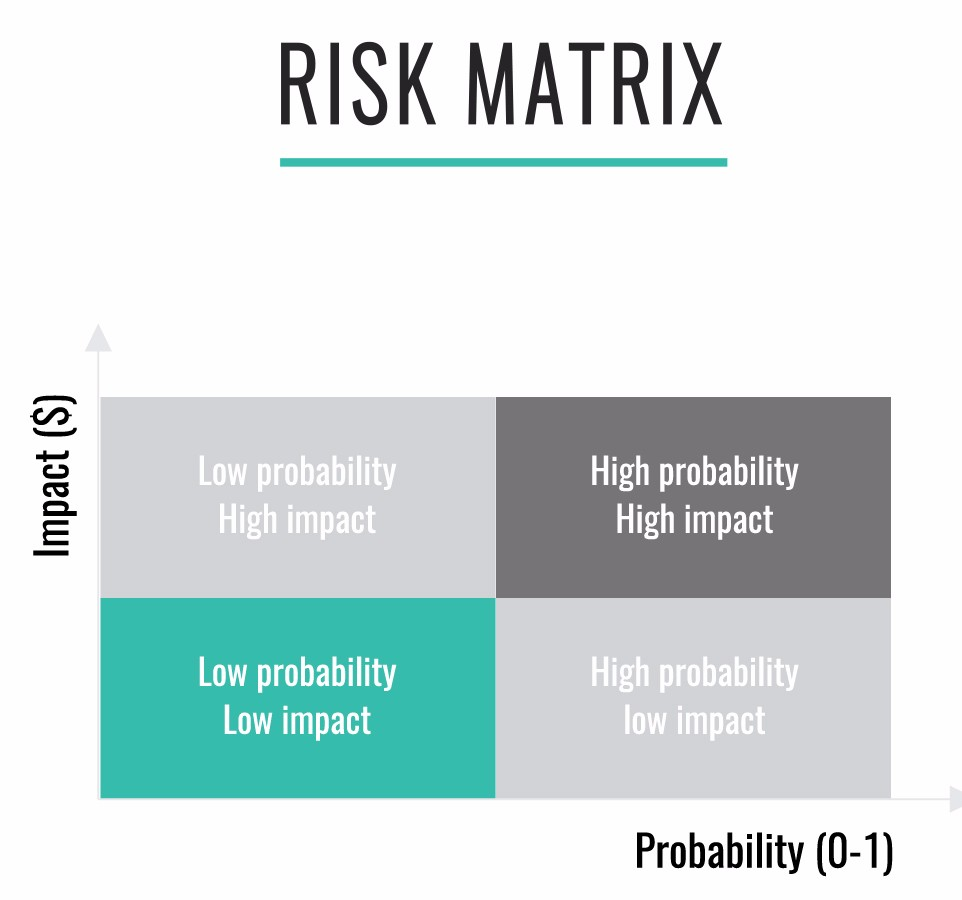
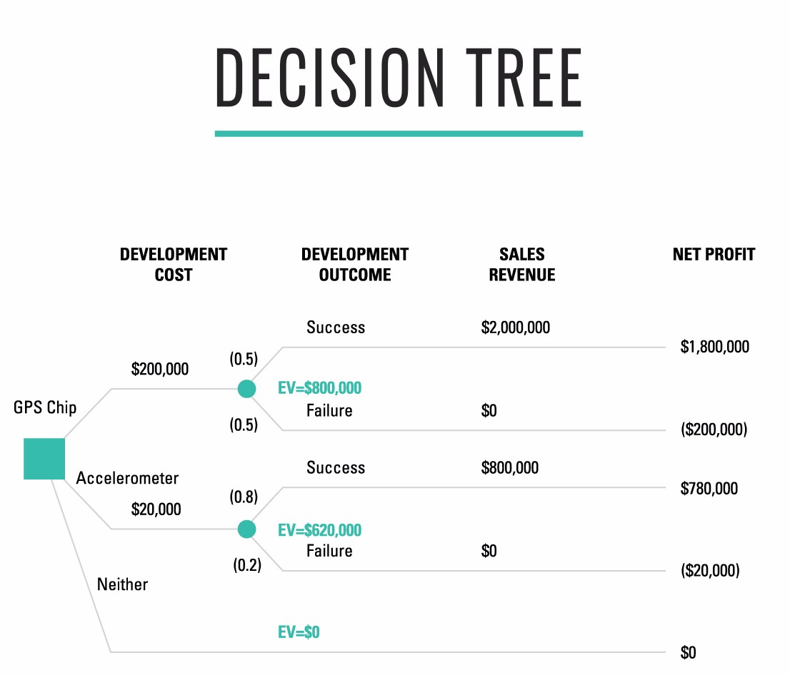
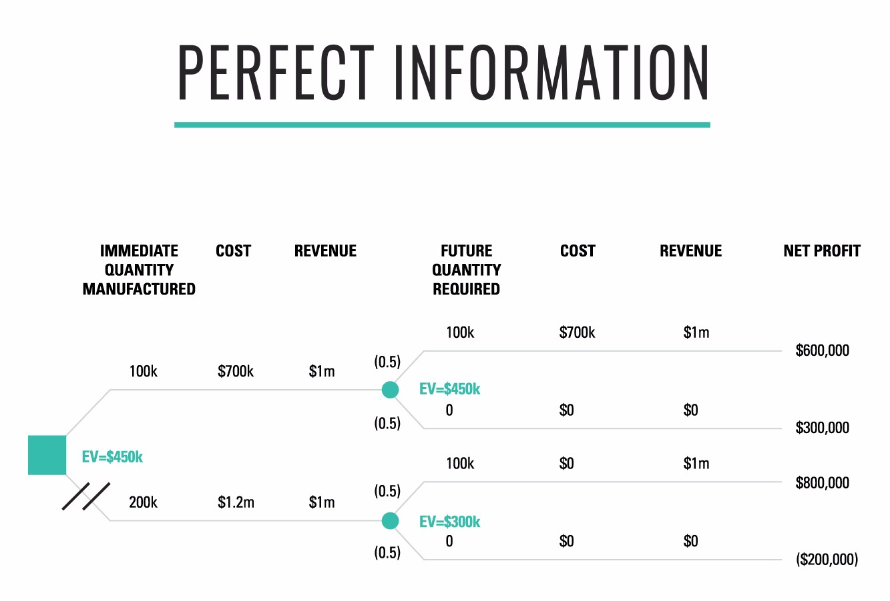
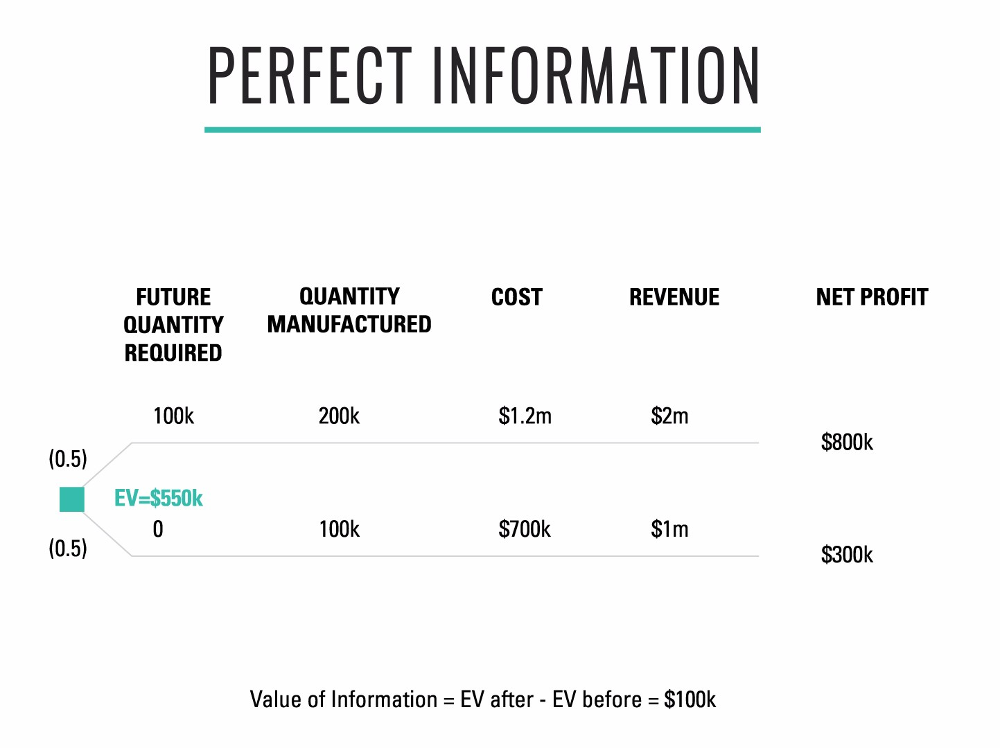
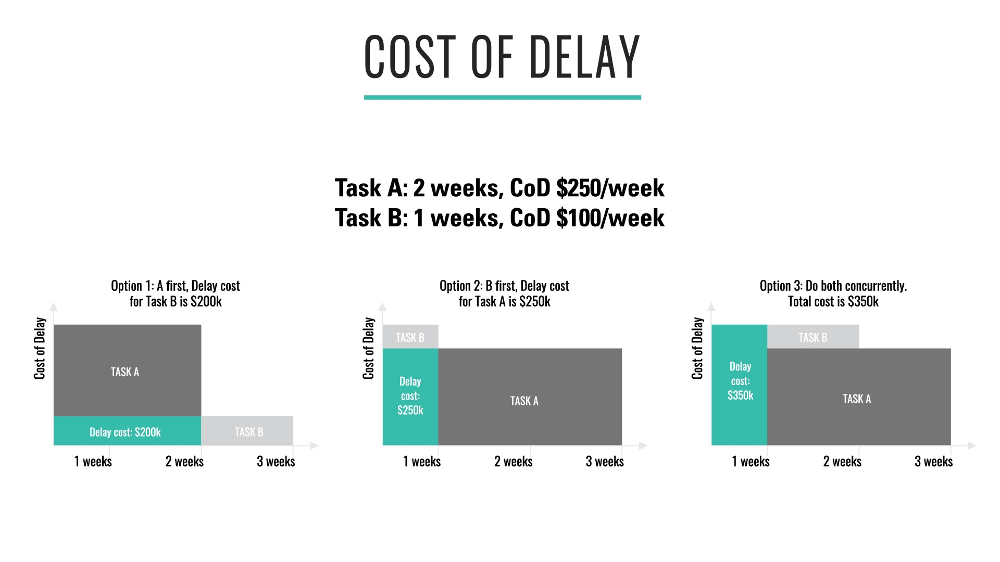
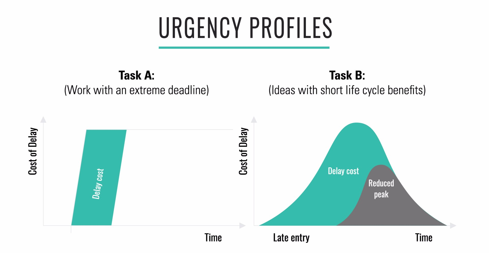

[<< back to main course website](index.html)

## Module 7: Economic Frameworks for Portfolio and Product Management

* [Watch Module 7 on LinkedIn Learning](https://www.linkedin.com/learning/lean-technology-strategy-economic-frameworks-for-portfolio-and-product-management)

### Unit 1: The Problems with Traditional Prioritization Frameworks

In this unit I discuss the importance of economic models for making good investment and prioritization decisions. The first problem with traditional frameworks is that they fail to take account of economics. The second is that they do not do an effective job of helping teams model and manage risk.

As Don Reinertsen, author of _The Principles of Product Development Flow_, says, “The measure of execution in product development is our ability to constantly align our plans to whatever is, at the moment, the best economic choice.”

There are two key ideas at the heart of the material in this module:

First, it’s important to choose a single metric that enables decision-making and trade-offs. Many industries have standard measures, for example “revenue per available seat mile” in the airline industry. If you don’t have one, use your national currency.

Second, for the purpose of making prioritization and investment decisions (unlike in accounting) we don’t need high levels of precision. People spend a lot of time in detailed estimation, but much of this investment is typically waste. Far more important are the discussions and shared understanding that come out thinking about investment and prioritization. The tools discussed in this model are very useful for driving those discussions, and particularly for identifying assumptions which can then be tested. This process of identifying and testing assumptions is essential to effective risk management.

### Unit 2: Introduction to Decision Trees

As Craig Kirkwood says in the introduction to his [primer on decision trees](http://www.public.asu.edu/~kirkwood/DAStuff/refs/decisiontrees/index.html), "The analysis of complex decisions with significant uncertainty can be confusing because 1) the consequence that will result from selecting any specified decision alternative cannot be predicted with certainty, 2) there are often a large number of different factors that must be taken into account when making the decision, 3) it may be useful to consider the possibility of reducing the uncertainty in the decision by collecting additional information, and 4) a decision maker's attitude toward risk taking can impact the relative desirability of different alternatives.” Humans are bad at making decisions with incomplete information, but it’s important to go through the exercise anyway, because the alternative is making decisions based on politics.

Decision trees are a key tool in decision theory that allow us to model the economics of making choices, and in particular to model risk. Making investment and prioritization decisions is primarily about effective risk management. The risk of an event can be defined as the cost or benefit of the event occurring (known as the _impact_), multiplied by the probability of the event occurring (from zero to one). This is known as the _expected value_ of the risk.

A very simple tool for modeling risk is a risk matrix, shown below. A very simple exercise to begin thinking about risk in product development is to put up a risk matrix and brainstorm possible events, putting them on the risk matrix on sticky notes. An important point to consider in risk management is _mitigation_. Typically we wouldn’t want to spend more money mitigating a risk than the expected value of the risk.

In this unit, we model an investment decision: should we build a GPS chip with a development cost of $200k, an expected revenue of $2m, and a 50% chance of success, or an accelerometer with a development cost of $20k, an expected revenue of $800k, and a probability of success of 80%? The decision tree for this example is shown below.

The expected value (EV) of building the GPS chip is $800k, and the EV of building the accelerometer is $620k. If you’re not sure how the calculations work, check out the video where I explain it in more detail. Thus the GPS chip is the better product to invest in. Note that you don’t need to estimate the net profit to the nearest dollar to make this decision! In this particular example, an estimate with 10% error in both calculations would still make the GPS chip the clear winner.

As an exercise, try building a decision tree for a couple of products you are thinking of investing in.

#### Exercise

Amoeba Manufacturing has contracted to provide Toronado Electronics with printed circuit boards (PCBs) under the following terms:

* 100,000 PCBs will be delivered to Toronado in one month;
* Toronado has an option to take delivery of an additional 100,000 boards in three months by giving Amoeba 30 days’ notice.
* Toronado will pay $10 for each board it purchases. Amoeba manufactures the PCBs using a batch process with the following costs:
* There is a fixed setup cost of $200,000 for any manufacturing batch run, regardless of the size of the run;
* There is a marginal manufacturing cost of $5 per board regardless of the size of the batch run.

Amoeba must decide whether to manufacture all 200,000 boards now, or whether to manufacture 100,000 now and manufacture the rest only if Toronado exercises its option to buy those boards.

If Amoeba manufactures 200,000 now and Toronado doesn’t exercise its option, then the manufacturing cost of the extra 100,000 boards will be totally lost. Amoeba believes there is a 50% chance Toronado will exercise its option to buy the additional 100,000 PCBs.

* Draw a decision tree for the decision that Amoeba faces;
* Determine the preferred course of action for Amoeba assuming it uses expected profit as its decision criterion.

### Unit 3: The Value of Information

_Note: this unit builds upon the problem I set following Unit 2. If you haven’t yet worked through this problem, please go back and do so now! The answer is given in the text below._

Information has value, and we need to know how much it’s worth in order to decide how much to invest in gathering it. Detailed estimation to support an product development investment decision is a common example of where we pay more than the information is worth.

According to Douglas Hubbard, author of _How to Measure Anything_, information has value in three different ways:

* Information reduces uncertainty about decisions that have economic consequences.
* Information affects the behavior of others, which has economic consequences.
* Information sometimes has its own market value.

Often we gather information in order to perform a _measurement_, which Hubbard defines as “A quantitively expressed reduction of uncertainty based on one or more observations.”

When we’re making investment or prioritization decisions, we gather information to reduce our uncertainty about those decisions. Using decision theory, we can express in quantitative terms the reduction in uncertainty we’re achieving through gathering information.

At the end of Unit 2, I gave you an problem to solve using decision theory. The answer is shown below:

Let’s consider the case where we knew whether or not we’d get the second order of PCBs. In this case, we can remove two paths through this decision tree - the path where we build 100k initially and then have to order another 100k, and the path where we order 200k but half of this batch is not required. Creating a decision tree with these two paths removed yields the solution below.

In this solution, the expected value is $550k, not $450k. Thus the value of this information is $100k - this is the limit of the amount we should pay for perfect information. This is a helpful way to calculate an upper limit on what we should pay for an experiment such as an MVP.

While decision trees are a great way of thinking about investment or prioritization decisions, they do have some limitations:

* Humans are risk averse when stakes are high. We can address this by using utility functions to model risk aversion (see Kirkwood’s _Decision Tree Primer_), or by reducing the stakes.
* Normally we deal with a continuum, not binary decision. This can be modeled using calculus or Monte Carlo methods (see Hubbard's _How to Measure Anything_).
* They don’t capture time dependence. To address this, we’ll look at Cost of Delay in the next unit.

### Unit 4: Cost of Delay

Cost of Delay is a way of making decisions by considering the impact on opportunity cost of making a choice in a way that takes account of time. Introducing time is important because getting $10 now is very different from getting $10 in one year (specifically, it has a different _net present value_, or NPV.) By calculating how much it costs us per unit time _not_ to deliver something - the cost of delay - we can make economic trade-offs in a rational, quantitative way.

Consider the following example. Say we have two pieces of work that we could begin when we arrive on Monday morning.We are assured that they are both of the highest priority. What should we do?

We start by calculating how much it will cost us if we do not do the work. Task A is to upgrade a core piece of software to a new version that supports encrypting credit card data to meet a compliance deadline, which is two weeks from now. We will be fined $50,000 per working day that we are not in compliance. The cost of not doing this work is zero up until the point at which the penalty kicks in, and the cost of delay for the work is $250,000 per week after the deadline. Task A will take two weeks.

Task B is to complete a key feature required by prospective customers, which we have already advertised will be ready one week from now. We expect we will close $100,000 of business per week when we release this new feature. Furthermore, one of our competitors is right behind us, and we believe they will release a new version of their software with this feature one month from now. Task B takes one week to complete.

The arithmetic is simple, and our options are shown above. If we perform Task A first, then we delay Task B by two weeks, costing us $200,000. If we perform Task B first, we delay Task A by a week, costing us $250,000. Thus we should perform Task A first.

We can also calculate what happens if we try and do both tasks simultaneously. Assuming we assign half our capacity to each, it will take us two weeks to complete Task B and three weeks to complete Task A. That leads to a total delay cost of $350,000. This shows we should still perform Task A first before Task B.

Of course, the example above is very simplistic. First of all, we assumed that the cost of delay would remain constant over time. This is rarely the case in real life. For example, the cost of delay for Task A rises to $50,000 per day right after the last day we can start the upgrade work to complete it in time to meet the external deadline. But for Task B, the amount of business we can close is likely to be time sensitive, given that our competitors will soon have a similar feature.

The time sensitivity of the cost of delay is captured in an urgency profile. Urgency profiles that might be used in real life for Task A and Task B are shown below. Cost of delay, on the y axis, represents the amount of money it costs per unit time to delay the work. To calculate the total delay cost, we measure the shaded area under the graph. Although in theory there are many possible urgency profiles, in general almost all tasks in a given organization will fit a handful of standard profiles. These can be modeled within a Kanban system by using classes of service.

One of the major benefits of Cost of Delay is that instead of arguing about answers to the questions we pose, we can reason about the assumptions we make in our models and focus on validating them. Cost of Delay enables a key cultural change: from political fights over whose work is more important to exposing and validating our assumptions and their effect on economic variables. This does require a certain level of organizational maturity. As with all process changes, we recommend starting off with a product where people actually want to try using Cost of Delay, and providing the necessary support to experiment with it.

As an exercise, try and work out the cost of delay of a release or a set of features for a product or service you're working on. Note that the precision doesn’t have to be high - to the nearest $1,000 dollars is fine in many cases.

### Unit 5: Conclusion

In this unit I present five principles for making investment and prioritization decisions:

* Use economic models to make investment decisions.
* Effective leaders find ways to lower the stakes.
* Only calculate to the precision you need.
* Large potential upside? Use optionality - particularly when uncertainty is high.
* Large potential downside? Limit exposure and use experiments.

#### Further Reading

* _The Principles of Product Development Flow: Second Generation Lean Product Development_ by Donald Reinertsen
* _How to Measure Anything: Finding the Value of Intangibles in Business_ by Douglas Hubbard
* [Decision Tree Primer](http://www.public.asu.edu/~kirkwood/DAStuff/refs/decisiontrees/index.html) by Craig Kirkwood

[<< back to main course website](index.html)
