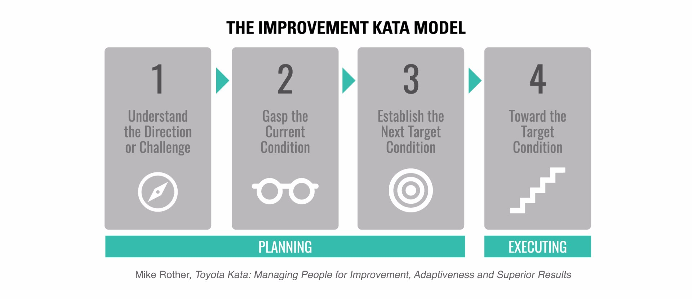
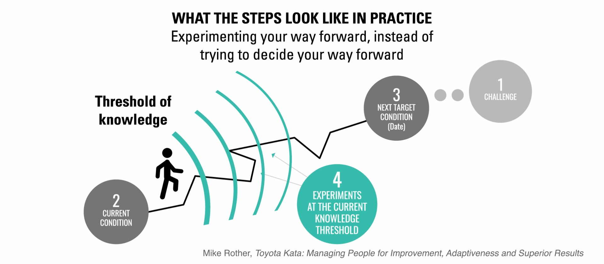
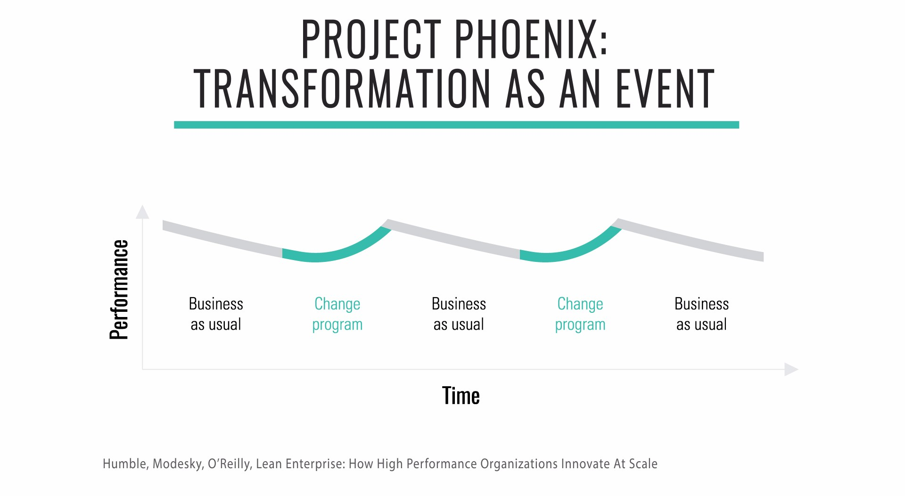
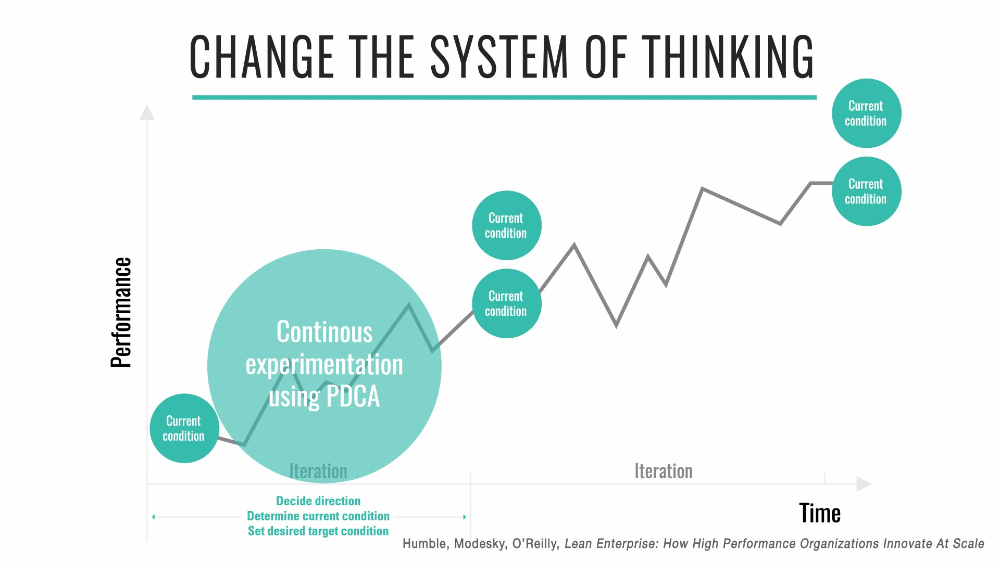
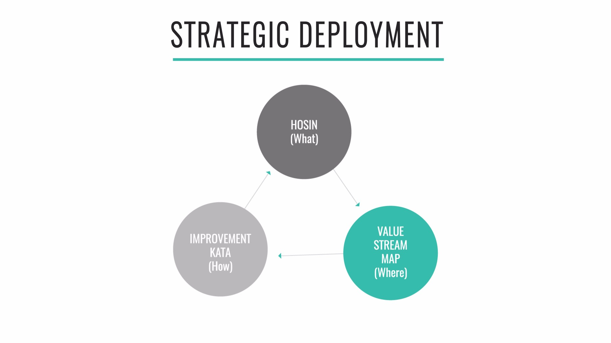
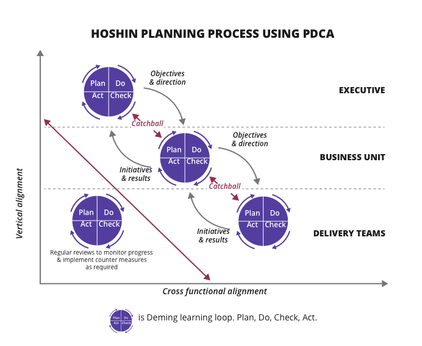

[<< back to main course website](index.html)

## Module 8: Starting Your Business Transformation

* [Watch Module 8 on LinkedIn Learning](https://www.linkedin.com/learning/lean-technology-strategy-starting-your-business-transformation-2)

### Unit 1: Deploying the Improvement Kata

The Improvement Kata, as described by Mike Rother in his book _Toyota Kata: Managing People for Improvement, Adaptiveness and Superior Results_, is a general-purpose framework and a set of practice routines for reaching goals where the path to the goal is uncertain. It requires us to proceed by iterative, incremental steps, using very rapid cycles of experimentation.

Following the Improvement Kata also increases the capabilities and skills of the people doing the work, because it requires them to solve their own problems through a process of continuous experimentation, thus forming an integral part of any learning organization. Finally, it drives down costs through identifying and eliminating waste in our processes.

A kata is a routine you practice deliberately, so its pattern becomes a habit. In Toyota, one of the main tasks of managers is to teach the Improvement Kata pattern to their teams and to facilitate running it (including coaching learners) as part of everyday work. This equips teams with a method to solve their own problems.

The Improvement Kata has four stages that we repeat in a cycle:

#### Understand the Direction

The direction is derived from the vision set by the organization’s leadership. A good vision is one that is inspiring—and, potentially, unattainable in practice. For example, the long-term vision for Toyota’s production operations is “One-piece flow at lowest possible cost.”

Following the Principle of Mission, we must understand the direction we are working in, at the level of the whole organization and at the level we are working on. Addressing the challenge should result in a measurable outcome for our customers, and we should plan to achieve it in six months to three years.

#### Grasp the Current Condition

Rother explains that analyzing the current condition “is done to obtain the facts and data you need in order to then describe an appropriate next target condition. What you’re doing is trying to find the current pattern of operation, so you can establish a desired pattern of operation (a target condition).”

#### Establish the Next Target Condition

The team grasps the current condition and establishes a target condition together. However, in the planning phase the team does not plan how to move to the target condition. In the Improvement Kata, people doing the work strive to achieve the target condition by performing a series of experiments, not by following a plan.

The target condition “describes in measurable detail how you want a process to function… [It is] a description and specification of the operating pattern you want a process or system to have on a future date.” A target condition identifies the process being addressed, sets the date by which we aim to achieve the specified condition, and specifies measurable details of the process as we want it to exist.

Rother recommends setting target conditions with a horizon between one week and three months out, with a preference for shorter horizons for beginners.

#### Towards the Target Condition

Since we are engaging in process innovation in conditions of uncertainty, we cannot know in advance how we will achieve the target condition. It’s up to the people doing the work to run a series of experiments using the Deming cycle (plan, do, check, act) to move towards the target condition.

The main mistakes people make when following the Deming cycle are performing it too infrequently and taking too long to complete a cycle. With Improvement Kata, everybody should be running experiments on a daily basis to learn and adapt as they progress.

### Unit 2: Leading Transformation

We've all been in the meeting and heard the speech "We need to transform!" But what are people really saying? Well, for the majority when they say we need to transform they are really saying you need to transform not me.

When organizations and managers see transformation as an event people see through it. We have all been the that project, the one we call Project Phoenix that will raise our business from the ashes and save us.

The challenge is people know this game. They know they only have to appear to verbally support and minimally demonstrate actions that prove that are "on-board" with Project Phoenix then wait... for the next change in leadership, direction or priority all while continuing to do what they have always done, just rebranded and renamed under a different process language, tools set or practices.

In high performing organizations, leadership has a sharp focus on the _value_ the organization is creating for its customers. Working scientifically toward challenging goals, which leads to identifying and removing or avoiding no-value-add activity, is the essence of Lean Thinking, and this requires a significant mindset change for most organizations.

In short, high performance organization don't do transformation as an event - they transform continuously.

To accelerate this process Toyota pair the Improvement Kata with the Coaching Kata's Five Questions. Each day or when individuals or leaders encounter obstacles in the work they go through the following five questions. The goal of the five questions is to design an experimental loop to tackle obstacles is a scientific and systematic manner:

1. What is the target condition?
2. What is the actual condition now?
3. What obstacles do you think are preventing you from reaching the target condition? Which one are you addressing now?
4. What is your next step? (Start of PDCA cycle.) What do you expect?
5. When can we go and see what we learned from taking that step?

As we continuously repeat the cycle, we reflect on the last step taken to introduce improvement. What did we expect? What actually happened? What did we learn? We might work on the same obstacle for several days.

Rother has made a guide to deploying the Improvement Kata and Coaching Kata, The Improvement Kata Handbook, [available for free on his website](http://www-personal.umich.edu/~mrother/Homepage.html).

### Unit 3: Running and Scaling Transformation Initiatives

Strategic planning should identify which problems need to be addressed and what information must be gathered to better understand each problem. Typically, even large organizations have limited capacity and can manage only a handful of initiatives at any one time; choosing what not to focus on and making sure the team sticks to its decision is critical.

The target objectives at the strategic level form the direction for the next organizational level, which then goes through its own Improvement Kata process. The target objectives at this level then form the direction for the next organizational level down.

This process, allowing us to set targets and manage resources and performance by creating alignment between levels in the organization, is called _strategy deployment_ (otherwise known as _Hoshin_ or _Hoshin Kanri_).

The process of creating alignment and consensus between levels is critical. In strategy deployment, this process is described as catchball, a word chosen to evoke a collaborative exercise. The target conditions from one level should not be transcribed directly into the direction for teams working at the level below; catchball is more about translation of strategy, with “each layer interpreting and translating what objectives from the level above mean for it.”

We should expect that feedback from teams will cause the higher-level plan to be updated. Don’t subvert Hoshin by using it to simply cascade targets down through the organization: the key to Hoshin is that it is a mechanism for creating alignment based on collaboration and feedback loops at multiple levels.

The time horizons for each level should be clearly defined, and regular review meetings scheduled, with target objectives updated based on the progress of the next-level teams. To be truly effective, this conversation must also be cross-functional, promoting cooperation along value streams, within and between business units.

#### Exercise questions

* How do you gather information for the current condition of your initiatives?
* Do you read reports or Go and See how the teams are progressing?
* Try practicing humble inquiry and the Coaching Kata Five Questions with teams.

### Unit 4: Ten Principles For Business Transformation

Transforming organizations, teams or even yourself is challenging. There’s no one-size-fits-all method to achieve success. It’s a combination of hard work, persistence and patience.

The most successful enterprises are continually experimenting to learn what works and what doesn’t. They focus on meeting customer needs by clarifying goals, shortening feedback loops and measuring performance based on outcomes, rather than outputs.

To become a high performance organization you must develop the capability to continually adapt, adjust and innovate. This requires a deliberate practice of experimentation and learning.

But experimentation alone is not the answer. To enable and empower decision-making at scale, team members need a framework of reference to align their actions to the organization’s mission. The mission is the statement of purpose for what your organization stands for. The principles help individuals and teams to make independent decisions at speed that are aligned to the organization’s mission, valued behaviors and desired culture. It is not a set of explicit rules or command-and-control statements of how people should operate.

Based on our own experiences we’ve distilled a set of [10 Principles Of Business Transformation](http://barryoreilly.com/2016/10/06/10-principles-to-transform/) to help businesses on their journey to become high performance organizations:

1. THINK BIG, Learn fast, Start now!
2. Executive mandate, sponsorship and support
3. Right people, right place
4. Act our way to a new culture
5. Build the right thing, then build it the right way
6. Small, fast, frequent delivery to build momentum
7. Create feedback loops with our customers
8. Adapt our approach based on validated learning
9. Demonstrable evidence for future investment decisions
10. Scale out learnings to cross the chasm

#### Exercise questions

* What would be your strategy for each of these principles?
* Where is the most uncertainty in your transformation?
* Is there an Executive mandate, sponsorship and support? If not, how can you create it?
* How will manage the uncertainty in your transformation plan?

[<< back to main course website](index.html)
